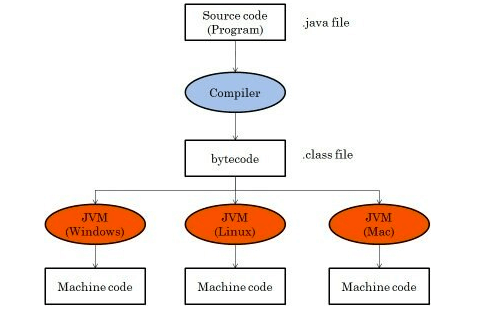

## 1. Java 기초

### 1.1 JDK와 JRE

**JDK(Java Development Kit)**  
- 자바 개발 키트입니다.  
- 프로그램 생성과 컴파일에 필요한 도구를 포함하고 있습니다.  
  (예: 컴파일러 `javac`, 콘솔, `javadoc` 등)

**JRE(Java Runtime Environment)**  
- 자바 실행 환경입니다.  
- 자바 프로그램 실행에 필요한 패키지를 포함하고 있습니다.  
  (예: 자바 가상 머신(JVM), 클래스 라이브러리, 명령어 등)

> **참고:** JDK는 JRE를 포함하고 있습니다.

---

### 1.2 바이트코드 파일

JDK를 설치하셨다면 자바 언어로 작성한 소스 파일을 만들고 컴파일할 수 있습니다.  
- **소스 파일 확장명:** `*.java`

- `javac`(java compiler) 명령어로 소스 파일을 `*.class` 확장자의 바이트코드ByteCode 파일로 생성합니다.
- 바이트코드는 운영체제(Window, Linux, MacOS 등)에 상관없이 독립적입니다.
- 컴파일된 바이트코드 파일(`.class`)은 기본적으로 소스 코드 파일(`.java`)과 동일한 디렉토리에 저장됩니다.

---

### 1.3 자바 가상 머신(JVM)

바이트코드 파일(`*.class`)을 운영체제가 이해하는 기계어로 번역하고 실행하는 명령어는 **`java`**입니다.  
- `java` 명령어는 **자바 가상 머신**Java Virtual Machine, JVM을 구동하여 바이트코드 파일을 기계어로 번역하고 실행합니다.

> **참고:** 바이트코드는 운영체제에 독립적이지만, JVM은 운영체제별로 다르게 설치됩니다.  
> (OS별 설치되는 JDK가 다릅니다.)

---

### 1.4 JAVA SE/EE/ME

**JAVA SE (Standard Edition)**  
- 표준 자바 플랫폼입니다.  
- 자바 언어의 대부분의 패키지를 포함하고 있습니다.

**JAVA EE (Enterprise Edition)**  
- 서버 개발을 위한 플랫폼입니다.  
- EJB 아키텍처 기반 컴포넌트, JSP, Servlet, JNDI 등을 포함한 개발에 사용됩니다.

**JAVA ME (Micro Edition)**  
- 제한된 자원을 가진 모바일 환경 등을 지원하기 위해 만들어진 플랫폼입니다.

---

### 1.5 코드 용어

**패키지 선언**  
`package com.src.ex01`  
- 소스 파일과 컴파일 후 생성되는 바이트코드 파일의 위치를 지정합니다.

**클래스 선언**  
`public class Example`  
- `Example`은 클래스 이름입니다.  
- 숫자로 시작할 수 없으며, 공백을 포함할 수 없습니다.  
- 소스 파일명과 대소문자가 완전히 일치해야 합니다.  
- 중괄호 `{...}`는 클래스 블록을 나타냅니다.

**main() 메서드**  
`public static void main(String[] args) {...}`  
- 프로그램 실행 시 가장 먼저 실행되는 메서드입니다.  
- **main() 메서드**를 프로그램 실행의 진입점entry point이라고 합니다.
- 중괄호 `{...}`는 메소드 블록을 나타냅니다.

---

### 1.6 코드 주석

주석은 컴파일 과정에서 무시되므로 바이트코드 파일의 크기에 영향을 주지 않습니다.

| **구분**       | **기호**     | **설명**                                   |
|----------------|-------------|-------------------------------------------|
| **행 주석**    | `//···`      | `//`부터 해당 행 끝까지 주석 처리합니다.    |
| **범위 주석**  | `/*···*/`    | `/*`와 `*/` 사이의 모든 내용을 주석 처리합니다. |
| **도큐먼트 주석** | `/**···*/` | `javadoc` 명령어로 API 문서를 생성할 때 사용합니다. |

> **참고:** 주석은 문자열 내부(`" "`)에서 작성할 수 없습니다.

---

### 1.7 자바 프로그램 개발 과정

자바 프로그램 개발은 다음 단계로 진행됩니다:

1. **소스 코드 작성 (`.java`)**  
   - 텍스트 에디터 또는 IDE를 사용해 자바 소스 코드를 작성합니다.  
   - 파일 확장자는 `.java`로 저장합니다.

2. **컴파일 (`.class`)**  
   - `javac` 명령어를 사용해 소스 코드를 바이트코드로 변환합니다.  
     예: `javac HelloWorld.java`  
   - 결과물로 `.class` 파일(바이트코드)이 생성됩니다.

3. **클래스 로딩**  
   - JVM이 시작되면서 필요한 `.class` 파일을 메모리에 로드합니다.  
   - 이 작업은 클래스 로더가 담당합니다.

4. **바이트코드 검증**  
   - 로드된 바이트코드가 자바의 보안 규칙을 준수하는지 검사합니다.  
   - 문제가 있는 코드는 실행되지 않습니다.

5. **실행**  
   - JVM의 인터프리터가 바이트코드를 한 줄씩 기계어로 변환해 실행합니다.  
     예: `java HelloWorld`  
   - JIT(Just-In-Time) 컴파일러는 자주 사용되는 코드를 네이티브 코드로 변환하여 성능을 향상시킵니다.

