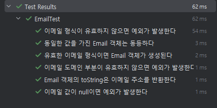

# TDD를 적용한 Email 값 객체 개발과정

개인 프로젝트를 진행하면서 처음으로 테스트 주도 개발(TDD) 방식을 적용해보았습니다. 이번 글에서는 도메인 주도 설계(DDD) 아키텍처를 도입하며 단순한 String 타입의 이메일을 값 객체(Value Object)로 표현하는 과정을 공유합니다.

## 값 객체(Value Object)의 개념

처음에는 이메일을 단순히 String으로 사용하는 것과 객체로 만드는 것의 차이점이 명확하지 않았습니다. 학습을 통해 값 객체가 DDD에서 중요한 개념임을 알게 되었습니다.

값 객체의 주요 특징:
- **식별성 없음**: 고유 식별자 대신 값 자체로 구분됩니다.
- **불변성(Immutability)**: 생성 후에는 상태를 변경할 수 없습니다.
- **동등성(Equality)**: 같은 값을 가진 객체들은 동등합니다.
- **자가 유효성 검증**: 객체 스스로 값의 유효성을 검증합니다.
- **개념적 완전성**: 관련된 속성과 동작을 하나의 단위로 캡슐화합니다.

본질적으로 이메일이라는 개념을 단순 문자열이 아닌, 특정 규칙과 동작을 가진 객체로 표현하는 것입니다.

## TDD 개발 과정

TDD는 "테스트를 먼저 작성하고, 이후에 구현한다"는 접근 방식입니다. 처음에는 낯설었지만 단계별로 진행해보았습니다.

### 1단계: 테스트 작성 (RED)

Email 클래스가 어떻게 동작해야 할지 테스트 코드로 정의했습니다.
아마도 홈페이지에 필요한 이미지 검증 절차는 다음과 같을 것입니다.
- 유효한 이메일 방식이면 Email 객체가 생성된다 
- 이메일 형식이 유효하지 않으면 예외가 발생한다 
- 이메일 값이 null이면 예외가 발생한다 
- 동일한 값을 가진 Email 객체는 동등하다 
- 이메일 도메인 부분이 유효하지 않으면 예외가 발생한다
- Email 객체의 toString은 이메일 주소를 반환한다 

원칙을 먼저 정하고, 이에 따라 테스트 코드를 작성했습니다.


```java
package com.mindful.domain.user.vo;

import org.junit.jupiter.api.DisplayName;
import org.junit.jupiter.api.Test;
import static org.assertj.core.api.Assertions.assertThat;
import static org.assertj.core.api.Assertions.assertThatThrownBy;

class EmailTest {

    @Test
    @DisplayName("유효한 이메일 형식이면 Email 객체가 생성된다")
    void createEmailWithValidFormat() {
        // given (준비): 테스트에 필요한 데이터
        String validEmailStr = "user@example.com";

        // when (실행): 테스트할 기능 실행
        Email email = new Email(validEmailStr);

        // then (검증): 결과 확인
        assertThat(email.getValue()).isEqualTo(validEmailStr);
    }

    @Test
    @DisplayName("이메일 형식이 유효하지 않으면 예외가 발생한다")
    void throwExceptionForInvalidEmailFormat() {
        // given
        String invalidEmailStr = "invalid-email"; // @ 기호 없음

        // when & then: 예외 발생 확인
        assertThatThrownBy(() -> new Email(invalidEmailStr))
                .isInstanceOf(IllegalArgumentException.class)
                .hasMessageContaining("잘못된 이메일 형식입니다");
    }

    @Test
    @DisplayName("이메일 값이 null이면 예외가 발생한다")
    void throwExceptionForNullEmail() {
        // given
        String nullEmailStr = null;

        // when & then
        assertThatThrownBy(() -> new Email(nullEmailStr))
                .isInstanceOf(IllegalArgumentException.class)
                .hasMessageContaining("이메일은 필수 값입니다");
    }

    @Test
    @DisplayName("동일한 값을 가진 Email 객체는 동등하다")
    void emailEquality() {
        // given
        Email email1 = new Email("same@example.com");
        Email email2 = new Email("same@example.com");

        // when & then
        assertThat(email1).isEqualTo(email2); // equals() 검사
        assertThat(email1.hashCode()).isEqualTo(email2.hashCode()); // hashCode() 검사
    }

    @Test
    @DisplayName("이메일 도메인 부분이 유효하지 않으면 예외가 발생한다")
    void emailValid(){
        // given
        String emailWithInvalidDomain = "user@invalid"; // 도메인이 불완전함

        // when & then
        assertThatThrownBy(() -> new Email(emailWithInvalidDomain))
                .isInstanceOf(IllegalArgumentException.class)
                .hasMessageContaining("잘못된 이메일 형식입니다");
    }

    @Test
    @DisplayName("Email 객체의 toString은 이메일 주소를 반환한다")
    void emailReturn(){
        // given
        String emailStr = "user@example.com";
        Email email = new Email(emailStr);

        // when & then
        assertThat(email.toString()).isEqualTo(emailStr);
    }
}
```

이 단계에서 배운 점:
- **given-when-then 패턴**은 테스트를 논리적으로 구조화하는 효과적인 방법입니다.
- **@DisplayName** 어노테이션을 통해 테스트의 목적을 한글로 명확하게 표현할 수 있습니다.
- **assertThatThrownBy** 메서드를 사용하여 예외 발생을 검증하는 방법을 학습했습니다.

이 시점에서는 Email 클래스가 아직 구현되지 않았거나 최소한의 구조만 있기 때문에 테스트를 실행하면 당연히 실패합니다(RED 단계).

### 2단계: 구현하기 (GREEN)

테스트를 통과시키기 위해 실제 Email 클래스와 검증 서비스를 구현했습니다. 처음에는 모든 기능을 Email 클래스에 넣으려 했으나, 단일 책임 원칙(SRP)에 따라 검증 로직을 별도의 클래스로 분리했습니다.

**EmailValidateService.java**:
```java
package com.mindful.domain.user.service;

import java.util.regex.Pattern;

public class EmailValidateService {

    // RFC 5322 표준을 따르는 이메일 정규식 패턴
    private static final String EMAIL_REGEX = "(?:[a-z0-9!#$%&'*+/=?^_`{|}~-]+(?:\\.[a-z0-9!#$%&'*+/=" +
            "?^_`{|}~-]+)*|\"(?:[\\x01-\\x08\\x0b\\x0c\\x0e-\\x1f\\x21\\x23-\\x5b\\x5d-\\x7f]|\\\\[\\x01" +
            "-\\x09\\x0b\\x0c\\x0e-\\x7f])*\")@(?:(?:[a-z0-9](?:[a-z0-9-]*[a-z0-9])?\\.)+[a-z0-9](?" +
            ":[a-z0-9-]*[a-z0-9])?|\\[(?:(?:25[0-5]|2[0-4][0-9]|[01]?[0-9][0-9]?)\\.){3}(?:25[0-5]|2[" +
            "0-4][0-9]|[01]?[0-9][0-9]?|[a-z0-9-]*[a-z0-9]:(?:[\\x01-\\x08\\x0b\\x0c\\x0e-\\x1f\\x21-\\" +
            "x5a\\x53-\\x7f]|\\\\[\\x01-\\x09\\x0b\\x0c\\x0e-\\x7f])+)\\])";

    private static final Pattern EMAIL_PATTERN = Pattern.compile(EMAIL_REGEX);

    public static void emailValidator(String value) {
        // null 값 검증
        if (value == null) {
            throw new IllegalArgumentException("이메일은 필수 값입니다");
        }
        
        // 정규식 패턴 검증
        if (!EMAIL_PATTERN.matcher(value).matches()) {
            throw new IllegalArgumentException("잘못된 이메일 형식입니다");
        }
    }
}
```

**Email.java**:
```java
package com.mindful.domain.user.vo;

import com.mindful.domain.user.service.EmailValidateService;
import lombok.Getter;
import java.util.Objects;

@Getter
public class Email {

    private final String value; // final 키워드로 불변성 확보

    public Email(String value) {
        // 외부 서비스를 통한 유효성 검증
        EmailValidateService.emailValidator(value);
        this.value = value;
    }

    @Override
    public boolean equals(Object o) {
        if (this == o) return true;
        if (o == null || getClass() != o.getClass()) return false;
        Email email = (Email) o;
        return Objects.equals(value, email.value);
    }

    @Override
    public int hashCode() {
        return Objects.hash(value);
    }

    @Override
    public String toString() {
        return value;
    }
}
```

이 구현으로 모든 테스트가 성공적으로 통과했습니다(GREEN 단계).



## 구현 과정에서의 고려사항

이번 구현에서 특히 주의 깊게 적용한 원칙들입니다:

1. **관심사 분리**: 이메일 유효성 검증 로직을 별도의 클래스로 분리하여 단일 책임 원칙을 준수했습니다.
2. **불변성 보장**: `final` 키워드를 사용하여 필드의 불변성을 확보했습니다.
3. **Lombok 활용**: `@Getter` 어노테이션을 사용하여 반복적인 코드를 줄였습니다.
4. **표준 준수**: 이메일 검증에 RFC 5322 표준을 준수하는 정규식을 사용했습니다.


현재는 TDD의 RED와 GREEN 단계까지 완료했습니다. 앞으로 추가 요구사항이 생기면 REFACTOR 작업을 진행할 예정입니다


## 학습 소감

TDD 방식으로 값 객체를 구현해본 것은 매우 의미 있는 경험이었습니다. 테스트를 먼저 작성하니 구현해야 할 기능이 명확해지고, 코드의 신뢰성을 확보할 수 있었습니다. 특히 값 객체 패턴을 통해 이메일이라는 도메인 개념을 더 명확하게 표현할 수 있었고, 이는 앞으로 다른 값 객체(Password, Username 등)를 구현할 때도 유용하게 적용할 수 있을 것입니다.

